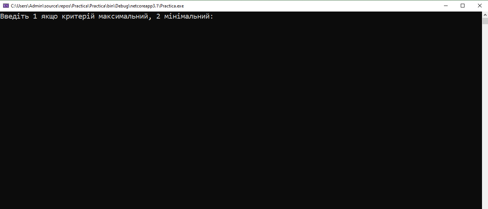
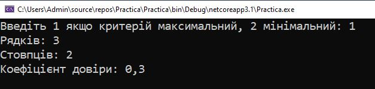
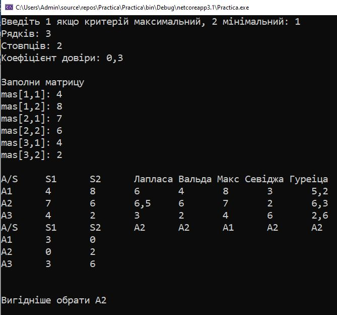

Для роботи з цим кодом потрібно скачати та запустити Visual Studio.
В Visual Studio треба запустити Practica.

Інструкція користувача
Запуск консольного додатку проходить за допомоги Visual Studia.
Спочатку треба вибрати максимальний чи мінімальний критерій.
 
Далі треба ввести кількість рядків, стовпців та коефіцієнті довіри
 
Потів вводите матрицю. Вводиться зліва на право.
І отримуєте результат. Зліва зверху під S1, S2 матриця яку вводили. Нижче матриця ризиків.
Правіше викорастані критерії Лапласа, Вальда, максимального оптимізму, Севіджа і Гурвіца. Під критеріями корисність. В кінці пише хто найвигідніший. 

